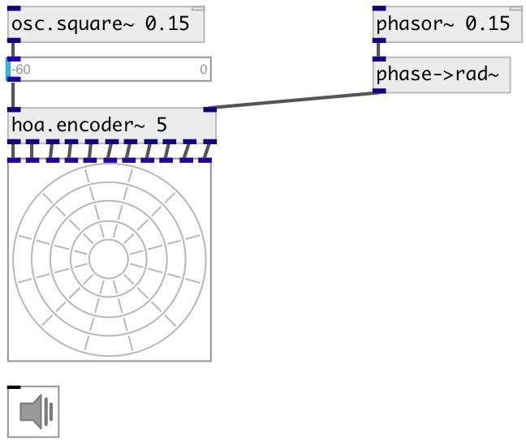

[index](index.html) :: [spat](category_spat.html)
---

# hoa.scope~

###### a 2d ambisonic harmonic scope

*доступно с версии:* 0.8

---

## информация
displays the circular harmonics of an ambisonic sound field

## аргументы:

* **ORDER**
the order of decomposition 
_тип:_ int 

## методы:

* **dump**
dumps all object info to Pd console window. 

* **pos**
set UI element position 
  __параметры:__
  - **X** top left x-coord 
    тип: float  
    обязательно: True  

  - **Y** top right y-coord 
    тип: float  
    обязательно: True  

## свойства:

* **@order** (readonly)
Получить the order of decomposition 
_тип:_ int 
_диапазон:_ 1..63 
_по умолчанию:_ 1 

* **@view** 
Получить/установить view rotation 
_тип:_ float 
_по умолчанию:_ 0 

* **@gain** 
Получить/установить gain 
_тип:_ float 
_минимальное значение:_ 0 
_по умолчанию:_ 1 

* **@refresh** 
Получить/установить redraw time 
_тип:_ int 
_единица:_ ms 
_диапазон:_ 20..1000 
_по умолчанию:_ 100 

* **@ph_color** 
Получить/установить positive harmonics color 
_тип:_ list 
_по умолчанию:_ 1 0 0 1 

* **@nh_color** 
Получить/установить negative harmonics color 
_тип:_ list 
_по умолчанию:_ 0 0 1 1 

* **@send** 
Получить/установить send destination 
_тип:_ symbol 
_по умолчанию:_ (null) 

* **@receive** 
Получить/установить receive source 
_тип:_ symbol 
_по умолчанию:_ (null) 

* **@size** 
Получить/установить element size (width, height pair) 
_тип:_ list 
_по умолчанию:_ 120 120 

* **@pinned** 
Получить/установить pin mode. if 1 - put element to the lowest level 
_тип:_ int 
_варианты:_ 0, 1 
_по умолчанию:_ 0 

* **@background_color** 
Получить/установить element background color (list of red, green, blue values in 0-1 range) 
_тип:_ list 
_по умолчанию:_ 0.93 0.93 0.93 1 

* **@border_color** 
Получить/установить border color (list of red, green, blue values in 0-1 range) 
_тип:_ list 
_по умолчанию:_ 0.6 0.6 0.6 1 

* **@fontsize** 
Получить/установить fontsize 
_тип:_ int 
_диапазон:_ 4..11 
_по умолчанию:_ 11 

* **@fontname** 
Получить/установить fontname 
_тип:_ symbol 
_по умолчанию:_ Helvetica 

* **@fontweight** 
Получить/установить font weight 
_тип:_ symbol 
_варианты:_ normal, bold 
_по умолчанию:_ normal 

* **@fontslant** 
Получить/установить font slant 
_тип:_ symbol 
_варианты:_ roman, italic 
_по умолчанию:_ roman 

* **@label** 
Получить/установить label text 
_тип:_ symbol 
_по умолчанию:_ (null) 

* **@label_color** 
Получить/установить label color in RGB format within 0-1 range, for example: 0.2 0.4 0.1 
_тип:_ list 
_по умолчанию:_ 0 0 0 1 

* **@label_inner** 
Получить/установить label position (1 - inner, 0 - outer). 
_тип:_ int 
_варианты:_ 0, 1 
_по умолчанию:_ 0 

* **@label_align** 
Получить/установить label horizontal align 
_тип:_ symbol 
_варианты:_ left, center, right 
_по умолчанию:_ left 

* **@label_valign** 
Получить/установить label vertical align 
_тип:_ symbol 
_варианты:_ top, center, bottom 
_по умолчанию:_ top 

* **@label_side** 
Получить/установить label snap side 
_тип:_ symbol 
_варианты:_ left, top, right, bottom 
_по умолчанию:_ top 

* **@label_margins** 
Получить/установить label offset in pixels 
_тип:_ list 
_по умолчанию:_ 0 0 

## входы:

* first input harmonic 
_тип:_ audio
* ... input harmonic 
_тип:_ audio
* n-th input harmonic 
_тип:_ audio

## ключевые слова:

[hoa](keywords/hoa.html)
[scope](keywords/scope.html)

**Авторы:** Serge Poltavsky, Pierre Guillot, Eliott Paris, Thomas Le Meur

**Лицензия:** GPL3 or later

