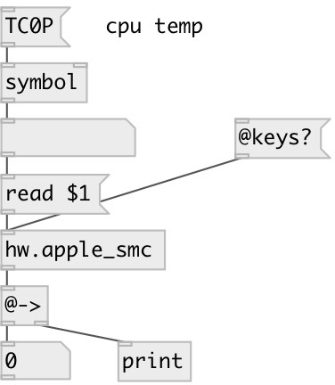

[index](index.html) :: [hw](category_hw.html)
---

# hw.apple_smc

###### query the system management control in Apples

*доступно с версии:* 0.8

---

## методы:

* **read**
query specified SMC key 
  __параметры:__
  - **KEY** SMC key 
    тип: symbol  
    обязательно: True  

## свойства:

* **@keys** (readonly)
Получить list of all found SMC key 
_тип:_ list 
_по умолчанию:_ #KEY $Adr $Num +LKS ACCL ACEN ACFP ACIC ACID ACIN ACLM AL! ALA0 ALA1 ALA2 ALA3 ALA4 ALA5 ALAT ALFC ALI0 ALI1 ALP0 ALP1 ALRV ALSC ALSF ALSL ALT0 ALT1 ALTH ALV0 ALV1 AUPO B0AC B0AV B0Al B0Am B0Ar B0As B0At B0Au B0BI B0CT B0FC B0LI B0RI B0RM B0St B0TF BATP BBAD BBIN BC1V BC2V BC3V BCHA BCHB BCHF BCHG BCHL BCHO BCHP BCHR BCHT BCHX BCLM BCMV BEMB BFCT BILB BILO BLPT BNCM BNCR BNum BPII BPIT BRII BRIT BRSC BSAC BSIn BTIL BTTI BTVI BTVR BTVT BWLM CHBI CHBV CHGC CHGD CHGI CHGV CHLC CLK! CLKC CLKH CLKS CLKT CLSD CLWK CRCB CRCU DPLM ECIP ECIT EPCA EPCF EPCI EPCV EPMA EPMI EPUA EPUF EPUI EPUV EVCT EVMD EVRD F0Ac F0ID F0Mn F0Mt F0Mx F0Tg FMAx FNum FPDc FPhz FS! FSDc G3WD HBKP HBKT HBWK HDBS HDST HDSW IB0R IB0r IC0C IC0R IC0c IC0r IC1C IC1c ID0R ID0r IN0C IN0c IO0R IO0r KWS4 LAcN LAtN LC2D LC2E LCCN LCCQ LCKA LCSA LCTN LCTQ LDEN LDI2 LDS4 LDSP LDWE LKSB LS! LSCF LSDD LSDU LSFD LSFU LSLB LSLF LSLN LSOF LSOO LSPV LSRB LSSB LSSE LSSS LSSV LSUP MACA MACM MACR MOCF MOCN MOHD MOHT MOLD MOLT MOST MOTP MOVX MOVY MOVZ MO_X MO_Y MO_Z MSAL MSAc MSAf MSAg MSAm MSBC MSBP MSBc MSBp MSDI MSDW MSG3 MSLB MSLC MSLD MSLF MSLG MSLP MSLT MSPA MSPC MSPS MSPs MSSD MSSE MSSF MSSG MSSP MSSS MSTC MSTM MSTS MSTc MSTf MSTg MSTm MSWA MSWE MSWF MSWO MSWP MSWR MSWr MSXC MSXD MSXK MSXN MSXS MSXb MSXc MSXd MSXk MSXm MSXn MSXs MSa! MSac MSaf MSag MSam MSap MVDS MVS4 NACK NATJ NATi NOPB NTOK ONMI PB0R PC0C PC0R PCPC PCPG PCPL PCPT PD0R PHPC PN0C PO0R PTHC PZ0F PZ0S RBr REV RMde RPlt RSvn RVBF RVUF SAS! SBF SBFC SBFD SBFE SBFN SBFU SBS! SCIA SCII SCIL SCXC SDAF SDAS SDRd SFBR SIS! SIT! SIU! SMBC SMBG SMBR SMBS SMBW SPH0 SPHR SPHS SPHT SPHZ SPS! SPT! SWER Sr0P Sr0T Sr1P Sr1T Sw0P Sw0T Sw1P Sw1T Sw2P Sw2T Sw3P Sw3T Sw4P Sw4T TB0T TB1T TB2T TC0C TC0D TC0E TC0F TC0J TC0P TC1C TC2C TCFC TCGC TCSA TCTD TM0P TM0S TMBS TP0P TPCD TW0P Th1H Ts0P Ts0S UPRC VC0C VC0c VD0R VD0r VN0R VN0r VP0R VP0r WKEN WVr0 WVw0 zDBG zDSF 

## входы:

* input 
_тип:_ control

## выходы:

* output key value 
_тип:_ control

## ключевые слова:

[motion](keywords/motion.html)
[sensor](keywords/sensor.html)

**Смотрите также:**
[\[hw.apple_sms\]](hw.apple_sms.html)
[\[hw.cpu_temp\]](hw.cpu_temp.html)

**Авторы:** Serge Poltavsky

**Лицензия:** GPL3 or later

