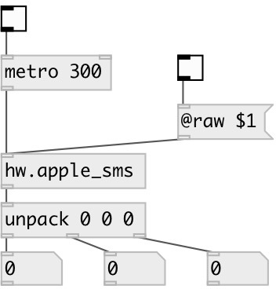

[index](index.html) :: [hw](category_hw.html)
---

# hw.apple_sms

###### query the sudden motion sensor in Apples

*доступно с версии:* 0.8

---

## информация
In raw output mode output values can be in various output range and sign, otherwise output data are normalized to float range, where positive *x* mean rightwards, positive *y* means rearwards, positive *z* mean upwards, but not all devices are in database. It it occures with your device (wrong direction), please, send us this information

## свойства:

* **@raw** 
Получить/установить raw data output mode 
_тип:_ int 
_варианты:_ 0, 1 
_по умолчанию:_ 0 

## входы:

* outputs current motion sensor information 
_тип:_ control

## выходы:

* list of three values: x-rotation, y-rotation, z-acceleration 
_тип:_ control

## ключевые слова:

[motion](keywords/motion.html)
[sensor](keywords/sensor.html)

**Авторы:** Serge Poltavsky

**Лицензия:** GPL3 or later

