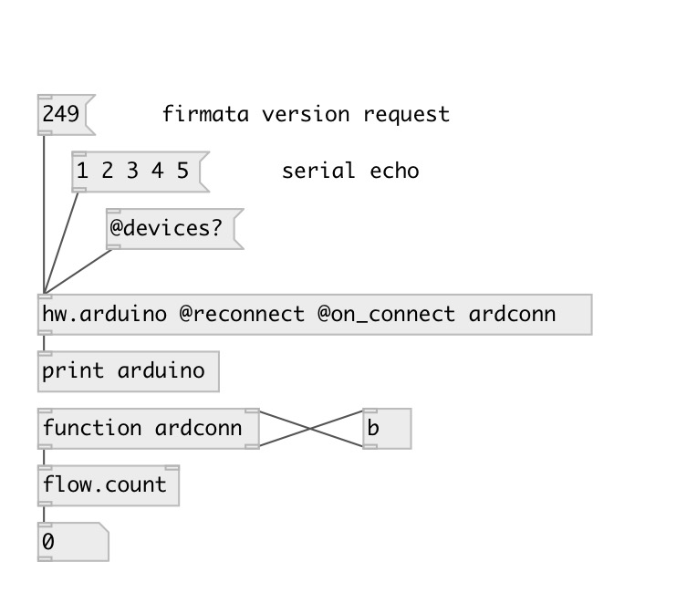

[index](index.html) :: [hw](category_hw.html)
---

# hw.arduino

###### Arduino device

*доступно с версии:* 0.5

---

## информация
Arduino serial port tha t supports reconnect and hotplug. If no properties are given tries to connect to first available and not opened device. If @reconnect flag is given, waits for device hotplug and reconnects to it.

## аргументы:

* **PORT**
serial port name, eg.: COM3 on Windows, /dev/ttyACM0 on Linux and
/dev/cu.usbmodem411 on MacOSX 
_тип:_ symbol 

* **RATE**
serial baud rate 
_тип:_ int 

## методы:

* **connect**
manually connect to device 

* **disconnect**
disconnect from device 

## свойства:

* **@port** (initonly)
Запросить/установить name of arduino serial port, eg.: COM3 on Windows, /dev/ttyACM0 on Linux and
/dev/cu.usbmodem411 on MacOSX. If specified on creation tries to connect to
this device only 
_тип:_ symbol 

* **@serial** 
Запросить/установить USB device serial number. If specified at creation, tries to connect to devices
only with such serial number 
_тип:_ symbol 

* **@rate** 
Запросить/установить serial baud rate. Standard value supported by most serial ports: 110, 300, 600,
1200, 2400, 4800, 9600, 14400, 19200, 28800, 38400, 56000, 57600, 115200 
_тип:_ int 
_варианты:_ 57600, 110, 300, 600, 1200, 2400, 4800, 9600, 14400, 19200, 38400, 56000, 115200, 128000, 256000 
_по умолчанию:_ 57600 

* **@vendor_id** 
Запросить/установить USB device vendor id. If specified at creation, tries to connect to devices
only with such vendor. Note: vendor id is specified in decimal mode, not in hex 
_тип:_ int 
_по умолчанию:_ 0 

* **@product_id** 
Запросить/установить USB device product id. If vendor and product ids are specified at creation,
tries to connect to devices only with such properties. Note: product id is
specified in decimal mode, not in hex 
_тип:_ int 
_по умолчанию:_ 0 

* **@reconnect** (initonly)
Запросить/установить enables hot-pluggin 
_тип:_ flag 
_по умолчанию:_ 0 

* **@connected** (readonly)
Запросить state of connection to device 
_тип:_ bool 
_по умолчанию:_ 0 

* **@devices** (readonly)
Запросить list of found Arduino devices 
_тип:_ list 

* **@on_connect** 
Запросить/установить function called every time on connect 
_тип:_ symbol 

## входы:

* sends float value in byte range [0-255] to arduino device 
_тип:_ control

## выходы:

* outputs received byte from arduino 
_тип:_ control

## ключевые слова:

[arduino](keywords/arduino.html)

**Авторы:** Serge Poltavsky

**Лицензия:** GPL3 or later

