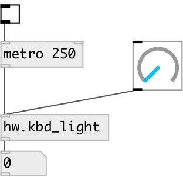

[index](index.html) :: [hw](category_hw.html)
---

# hw.kbd_light

###### Get/set keyboard light on some devices

*доступно с версии:* 0.8

---

## информация
Only Apple keyboards are supported at this moment

## входы:

* sets current keyboards light level (no output) 
_тип:_ control

## выходы:

* keyboard light level in range 0...1 
_тип:_ control

## ключевые слова:

[keyboard](keywords/keyboard.html)

**Авторы:** Serge Poltavsky, Hans-Christoph Steiner

**Лицензия:** GPL3 or later

