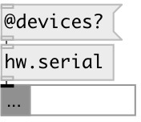

[index](index.html) :: [hw](category_hw.html)
---

# hw.serial

###### serial port device

*доступно с версии:* 0.5

---

## аргументы:

* **RATE**
serial baud rate 
_тип:_ int 

* **PORT**
serial device or port name, eg.: COM3 on Windows, /dev/ttyACM0 on Linux and
/dev/cu.usbmodem411 on MacOSX 
_тип:_ symbol 

## методы:

* **close**
disconnect from device 

* **open**
connect to device 

## свойства:

* **@port** 
Запросить/установить name of serial port, eg.: COM3 on Windows, /dev/ttyACM0 on Linux and
/dev/cu.usbmodem411 on MacOSX 
_тип:_ symbol 

* **@rate** 
Запросить/установить serial baud rate 
_тип:_ int 
_варианты:_ 110, 300, 600, 1200, 2400, 4800, 9600, 14400, 19200, 38400, 56000, 57600, 115200, 128000, 256000 
_по умолчанию:_ 57600 

* **@devices** (readonly)
Запросить list of found serial devices 
_тип:_ list 

## входы:

* sends float value in byte range [0-255] to serial port 
_тип:_ control

## выходы:

* outputs received byte from serial port 
_тип:_ control

## ключевые слова:

[serial](keywords/serial.html)

**Авторы:** Serge Poltavsky

**Лицензия:** GPL3 or later

