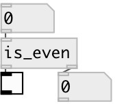

[index](index.html) :: [predicates](category_predicates.html)
---

# is_even

###### checks if input number is even

*доступно с версии:* 0.1

---

## входы:

* outputs &#39;1&#39; if number can be divided exactly by 2, otherwise &#39;0&#39; 
_тип:_ control

## выходы:

* 0 or 1 
_тип:_ control
* passed even numbers 
_тип:_ control

## ключевые слова:

[predicate](keywords/predicate.html)
[numbers](keywords/numbers.html)

**Смотрите также:**
[\[is_odd\]](is_odd.html)

**Авторы:** Serge Poltavsky

**Лицензия:** GPL3 or later

