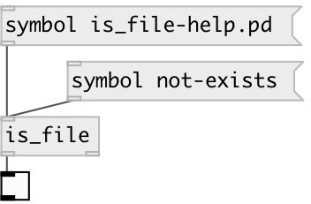

[index](index.html) :: [predicates](category_predicates.html)
---

# is_file

###### checks if file exists and accessible

*доступно с версии:* 0.2

---

## информация
If relative path is given file searched under patch directory

## входы:

* outputs &#39;1&#39; if file exists and can be opened, otherwise &#39;0&#39; 
_тип:_ control

## выходы:

* 0 or 1 
_тип:_ control
* symbol os String: pass filename if file exists 
_тип:_ control

## ключевые слова:

[predicate](keywords/predicate.html)
[filesystem](keywords/filesystem.html)

**Авторы:** Serge Poltavsky

**Лицензия:** GPL3 or later

