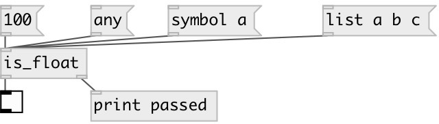

[index](index.html) :: [predicates](category_predicates.html)
---

# is_float

###### checks if input data has *float* type

*доступно с версии:* 0.1

---

## входы:

* outputs &#39;1&#39; to 1st outlet, otherwise &#39;0&#39; 
_тип:_ control

## выходы:

* 0 or 1 
_тип:_ control
* passes *float* message 
_тип:_ control

## ключевые слова:

[predicate](keywords/predicate.html)
[float](keywords/float.html)

**Смотрите также:**
[\[is_any\]](is_any.html)
[\[is_bang\]](is_bang.html)
[\[is_symbol\]](is_symbol.html)
[\[is_list\]](is_list.html)

**Авторы:** Serge Poltavsky

**Лицензия:** GPL3 or later

