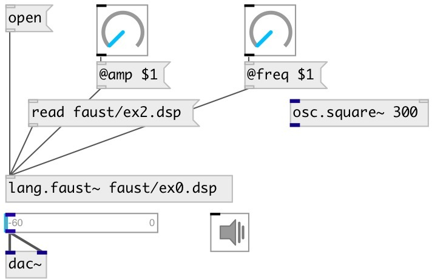

[index](index.html) :: [lang](category_lang.html)
---

# lang.faust~

###### faust realtime compilation

*доступно с версии:* 0.9.2

---

## аргументы:

* **LOAD**
initial file to load after object creation 
_тип:_ symbol 

## методы:

* **open**
open editor window 

* **reset**
reset object state 

* **read**
read Faust code from file and compile it. 
  __параметры:__
  - **FILE** file path, absolute or relative to patch, include directories 
    тип: symbol  
    обязательно: True  

* **write**
write Faust code to file. 
  __параметры:__
  - **FILE** file path, absolute or relative to patch 
    тип: symbol  
    обязательно: True  

  - **[@force]** overwrite existing files 
    тип: property  

## свойства:

* **@include** 
Запросить/установить list of faust include directories 
_тип:_ list 

* **@active** 
Запросить/установить on/off dsp processing 
_тип:_ bool 
_по умолчанию:_ 1 

* **@load** (initonly)
Запросить/установить initial file to load after object creation 
_тип:_ symbol 

## входы:

* control input 
_тип:_ control
* first faust input 
_тип:_ audio
* ... faust input 
_тип:_ audio
* n-th faust input 
_тип:_ audio

## выходы:

* first faust output 
_тип:_ audio
* ... faust output 
_тип:_ audio
* n-th faust output 
_тип:_ audio

## ключевые слова:

[faust](keywords/faust.html)

**Авторы:** Serge Poltavsky

**Лицензия:** GPL3 or later

