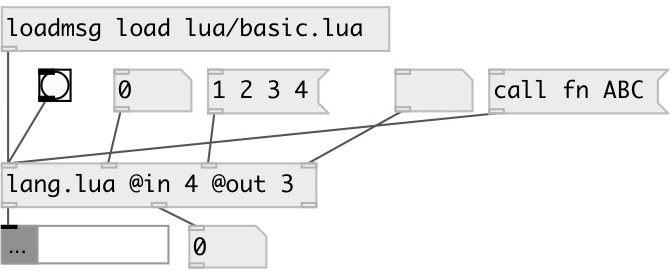

[index](index.html) :: [lang](category_lang.html)
---

# lang.lua

###### Lua JIT language bindings

*доступно с версии:* 0.9.5

---

## информация
Lua code is executed in separated thread in async mode. Each lang.lua object has own independent context.

## аргументы:

* **IN**
number of inputs 
_тип:_ int 

* **OUT**
number of outputs 
_тип:_ int 

## методы:

* **load**
load lua file and eval it 
  __параметры:__
  - **PATH** path to lua file 
    тип: list  
    обязательно: True  

* **eval**
eval lua code 
  __параметры:__
  - **CODE** lua code 
    тип: list  
    обязательно: True  

* **quit**
abort lua script execution 

* **call**
call lua function 
  __параметры:__
  - **FN** function name 
    тип: symbol  
    обязательно: True  

  - **[ARGS]** function arguments 
    тип: list  

## свойства:

* **@in** (initonly)
Запросить/установить number of inputs 
_тип:_ int 
_диапазон:_ 1..16 
_по умолчанию:_ 1 

* **@out** (initonly)
Запросить/установить number of outputs 
_тип:_ int 
_диапазон:_ 1..16 
_по умолчанию:_ 1 

## входы:

* first lua input 
_тип:_ control
* ... lua input 
_тип:_ control
* n-th lua input 
_тип:_ control

## выходы:

* first lua output 
_тип:_ control
* ... lua output 
_тип:_ control
* n-th lua output 
_тип:_ control

## ключевые слова:

[lua](keywords/lua.html)
[jit](keywords/jit.html)

**Авторы:** Serge Poltavsky

**Лицензия:** GPL3 or later

