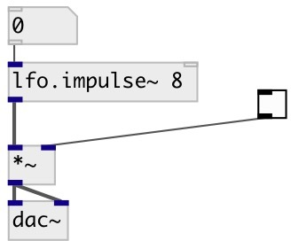

[index](index.html) :: [lfo](category_lfo.html)
---

# lfo.impulse~

###### Unit-amplitude low-frequency impulse train

*доступно с версии:* 0.1

---

## аргументы:

* **freq**
frequency 
_тип:_ float 
_единица:_ Hz 

## свойства:

* **@active** 
Запросить/установить on/off dsp processing 
_тип:_ bool 
_по умолчанию:_ 1 

## входы:

* frequency in Hz 
_тип:_ audio
* reset phase 
_тип:_ control

## выходы:

* output signal 
_тип:_ audio

## ключевые слова:

[lfo](keywords/lfo.html)
[oscillator](keywords/oscillator.html)

**Авторы:** Serge Poltavsky

**Лицензия:** GPL3 or later

