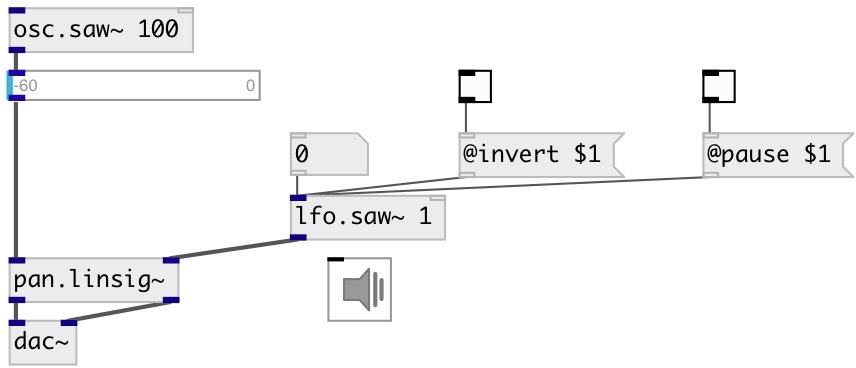

[index](index.html) :: [lfo](category_lfo.html)
---

# lfo.saw~

###### Full-range unit-amplitude low frequency saw

*доступно с версии:* 0.7

---

## аргументы:

* **FREQ**
frequency 
_тип:_ float 
_единица:_ Hz 

* **INVERT**
wave inversion 
_тип:_ bool 

## методы:

* **reset**
reset to initial state 

## свойства:

* **@invert** 
Запросить/установить wave inversion 
_тип:_ bool 
_по умолчанию:_ 0 

* **@pause** 
Запросить/установить pause oscillator at current value 
_тип:_ bool 
_по умолчанию:_ 0 

* **@phase** 
Запросить/установить initial phase 
_тип:_ float 
_диапазон:_ 0..1 
_по умолчанию:_ 0 

* **@active** 
Запросить/установить on/off dsp processing 
_тип:_ bool 
_по умолчанию:_ 1 

## входы:

* frequency in Hz (can be zero or negative) 
_тип:_ audio
* reset phase 
_тип:_ control

## выходы:

* saw wave in [-1, +1] range 
_тип:_ audio

## ключевые слова:

[lfo](keywords/lfo.html)
[oscillator](keywords/oscillator.html)
[saw](keywords/saw.html)
[phasor](keywords/phasor.html)

**Смотрите также:**
[\[lfo.+saw~\]](lfo.%2Bsaw~.html)
[\[lfo.square~\]](lfo.square~.html)
[\[lfo.impulse~\]](lfo.impulse~.html)

**Авторы:** Serge Poltavsky

**Лицензия:** GPL3 or later

