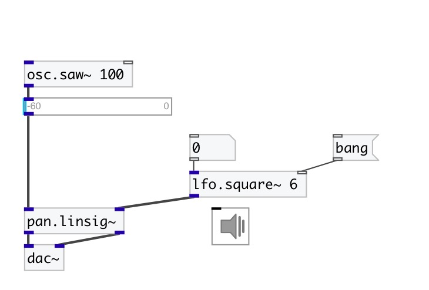

[index](index.html) :: [lfo](category_lfo.html)
---

# lfo.square~

###### Zero-mean unit-amplitude low frequency square wave

*доступно с версии:* 0.1

---

## аргументы:

* **FREQ**
frequency 
_тип:_ float 
_единица:_ Hz 

## методы:

* **reset**
reset to initial state 

## свойства:

* **@active** 
Запросить/установить on/off dsp processing 
_тип:_ bool 
_по умолчанию:_ 1 

* **@pause** 
Запросить/установить pause oscillator at current value 
_тип:_ bool 
_по умолчанию:_ 0 

* **@phase** 
Запросить/установить initial phase 
_тип:_ float 
_диапазон:_ 0..1 
_по умолчанию:_ 0 

* **@osc** (initonly)
Запросить/установить OSC server name to listen 
_тип:_ symbol 

* **@id** (initonly)
Запросить/установить OSC address id. If specified, bind all properties to /ID/lfo_square/PROP_NAME
osc address, if empty bind to /lfo_square/PROP_NAME. 
_тип:_ symbol 

## входы:

* frequency in Hz 
_тип:_ audio
* reset phase 
_тип:_ control

## выходы:

* output signal 
_тип:_ audio

## ключевые слова:

[lfo](keywords/lfo.html)
[oscillator](keywords/oscillator.html)
[square](keywords/square.html)

**Смотрите также:**
[\[lfo.+square~\]](lfo.%2Bsquare~.html)
[\[lfo.impulse~\]](lfo.impulse~.html)
[\[lfo.tri~\]](lfo.tri~.html)

**Авторы:** Serge Poltavsky

**Лицензия:** GPL3 or later

