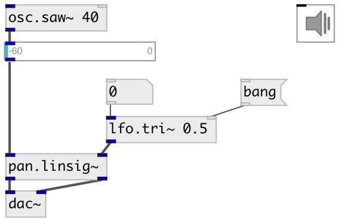

[index](index.html) :: [lfo](category_lfo.html)
---

# lfo.tri~

###### Zero-mean unit-amplitude low frequency triangle wave

*доступно с версии:* 0.1

---

## аргументы:

* **freq**
frequency 
_тип:_ float 
_единица:_ Hz 

## методы:

* **reset**
reset to initial state 

## свойства:

* **@active** 
Получить/установить on/off dsp processing 
_тип:_ int 
_варианты:_ 0, 1 
_по умолчанию:_ 1 

* **@pause** 
Получить/установить pause oscillator at current value 
_тип:_ int 
_варианты:_ 0, 1 
_по умолчанию:_ 0 

* **@phase** 
Получить/установить initial phase 
_тип:_ float 
_диапазон:_ 0..1 
_по умолчанию:_ 0 

## входы:

* frequency in Hz (can be zero or negative) 
_тип:_ audio
* reset phase 
_тип:_ control

## выходы:

* triangle wave in [1,-1] range 
_тип:_ audio

## ключевые слова:

[lfo](keywords/lfo.html)
[oscillator](keywords/oscillator.html)
[triangle](keywords/triangle.html)

**Смотрите также:**
[\[lfo.+tri~\]](lfo.%2Btri~.html)
[\[lfo.square~\]](lfo.square~.html)
[\[lfo.impulse~\]](lfo.impulse~.html)

**Авторы:** Serge Poltavsky

**Лицензия:** GPL3 or later

