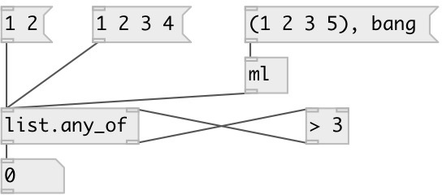

[index](index.html) :: [list](category_list.html)
---

# list.any_of

###### checks if at least one list element is accepted by predicate

*доступно с версии:* 0.1

---

## информация
Note: also data.mlist

## входы:

* Input list 
_тип:_ control
* input value from predicate. &#34;1&#34; means accepted. &#34;0&#34; means reject. 
_тип:_ control

## выходы:

* 1 - if predicate object returns true for all the elements or list is empty or 0 otherwise. 
_тип:_ control
* atom to predicate 
_тип:_ control

## ключевые слова:

[list](keywords/list.html)
[predicate](keywords/predicate.html)
[any](keywords/any.html)

**Смотрите также:**
[\[list.all_of\]](list.all_of.html)
[\[list.none_of\]](list.none_of.html)

**Авторы:** Serge Poltavsky

**Лицензия:** GPL3 or later

