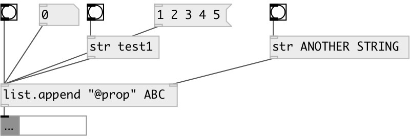

[index](index.html) :: [list](category_list.html)
---

# list.append

###### append atom or list to the end of input list

*доступно с версии:* 0.6

---

## информация
Works with data atoms

## аргументы:

* **LIST**
appended value 
_тип:_ list 

## свойства:

* **@value** 
Получить/установить append value 
_тип:_ list 

## входы:

* treated as empty input list 
_тип:_ control
* set appended list 
_тип:_ control

## выходы:

* output concatenated list 
_тип:_ control

## ключевые слова:

[list](keywords/list.html)
[append](keywords/append.html)

**Смотрите также:**
[\[list append\]](list%20append.html)

**Авторы:** Serge Poltavsky

**Лицензия:** GPL3 or later

