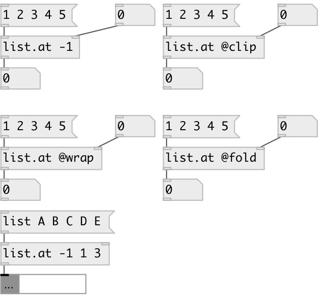

[index](index.html) :: [list](category_list.html)
---

# list.at

###### outputs list element(s) at specified index(es)

*доступно с версии:* 0.1

---

## информация
Returns the element at the given index position in the list. @rel property allows to acess elements in range (-LIST_SIZE, LIST_SIZE). Negative index means position from the end of the list. For example: -1 returns last element. @clip property: if element index &lt; 0 - first element returned. If element index &gt;= LIST_SIZE last element returned. @wrap property: in range [0, LIST_SIZE) ordinal elements are returned. Other indexes are wrapped by modulo division.

## аргументы:

* **INDEX**
single or multiple elements position 
_тип:_ list 

## свойства:

* **@method** 
Запросить/установить methods of processing of negative/invalid indexes 
_тип:_ symbol 
_варианты:_ rel, clip, fold, wrap 
_по умолчанию:_ rel 

* **@rel** 
Запросить/установить alias to @method rel. Negative index means position from the end of the list 
_тип:_ alias 

* **@clip** 
Запросить/установить alias to @method clip. If index &lt; 0 - return first element. If index greater or
equal list size - return last element 
_тип:_ alias 

* **@fold** 
Запросить/установить alias to @method fold. In range [0, LIST_SIZE) ordinal elements are returned.
[LIST_SIZE, 2*LIST_SIZE) - returned in negative order etc. 
_тип:_ alias 

* **@wrap** 
Запросить/установить alias to @method wrap. In range [0, LIST_SIZE) ordinal elements are returned.
Other indexes are wrapped by modulo division. 
_тип:_ alias 

* **@index** 
Запросить/установить indexes 
_тип:_ list 
_по умолчанию:_ 0 

* **@default** 
Запросить/установить default output value if not found. If not set, outputs error message to console 
_тип:_ atom 
_по умолчанию:_ null 

## входы:

* input list 
_тип:_ control
* positions 
_тип:_ control

## выходы:

* element(s) at the given index position(s). If element not found at specified position and @default property is set, output that default value 
_тип:_ control

## ключевые слова:

[list](keywords/list.html)

**Смотрите также:**
[\[list.^at\]](list.%5Eat.html)
[\[list.apply_to\]](list.apply_to.html)

**Авторы:** Serge Poltavsky

**Лицензия:** GPL3 or later

