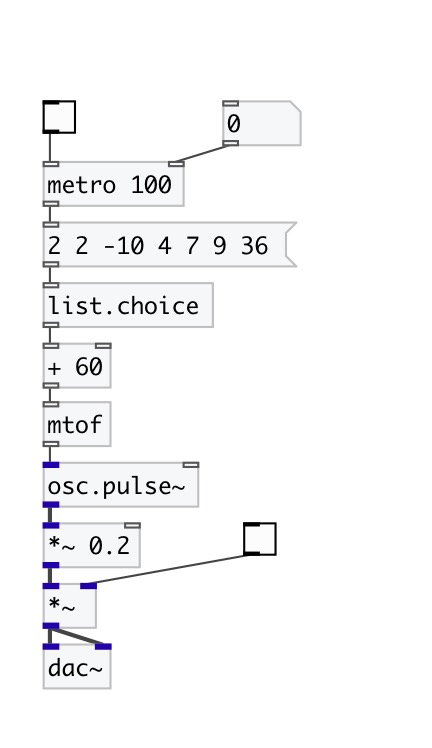

[< справка — содержание](index.html)
---

# list.choice

Выбирает случайный элемент из списка

---

 

---

---
аргументы:

---
свойства:

@norepeat: Свойство norepeat property. Если установлено значение 1: каждое новое значение на выходе берется из нового элемента списка и не повторяется. 

---
смотрите также: 

