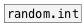

[< справка — содержание](ceammc_lib.html)
---

# list.choice


Выбирает случайный элемент из списка

---

<br>


---


```


[_]      [F]
|        |.
[metro 100]
|
[2 2 -10 4 7 9 36(
|
[list.choice]
|
[+ 60]
|
[mtof]
|
[osc.pulse~]
|
[*~ 0.2]  [_]
|         |.
[*~        ]
|\
[dac~]

            
```

---
аргументы:


---
свойства:

@norepeat: Свойство norepeat property. Если установлено значение 1: каждое новое значение на выходе берется из нового элемента списка и не повторяется.<br>

---
смотрите также:<br>
[](random.int.html)
