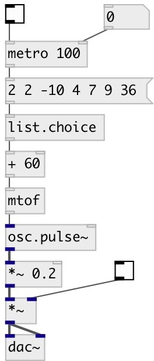

[index](index.html) :: [list](category_list.html)
---

# list.choice

###### outputs random element from list

*доступно с версии:* 0.1

---

## свойства:

* **@norepeat** 
Запросить/установить norepeat property. If 1 is given: every time output value at new list position,
do not repeat choosed position twice at adjacent events. 
_тип:_ bool 
_по умолчанию:_ 0 

## входы:

* Input list 
_тип:_ control

## выходы:

* random list element 
_тип:_ control

## ключевые слова:

[list](keywords/list.html)
[random](keywords/random.html)
[choice](keywords/choice.html)

**Смотрите также:**
[\[random.int\]](random.int.html)

**Авторы:** Serge Poltavsky

**Лицензия:** GPL3 or later

