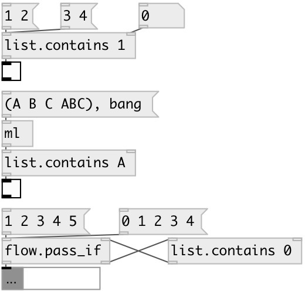

[index](index.html) :: [list](category_list.html)
---

# list.contains

###### checks if input list contains specified atoms

*доступно с версии:* 0.6

---

## аргументы:

* **SUBLIST**
list for @sublist mode 
_тип:_ list 

## свойства:

* **@sublist** 
Запросить/установить sublist mode, output 1 if input list contains this property value as sublist,
otherwise 0 
_тип:_ list 

* **@all_of** 
Запросить/установить all_of mode, output 1 is input list contains all of this property values 
_тип:_ list 

* **@any_of** 
Запросить/установить any_of mode, output 1 is input list contains any (al least one) of this
property values 
_тип:_ list 

* **@none_of** 
Запросить/установить none_of mode, output 1 is input list contains none of this property values 
_тип:_ list 

## входы:

* check is list is contains specified atom or sequence 
_тип:_ control
* set search atoms 
_тип:_ control

## выходы:

* 1 on success, otherwise 0 
_тип:_ control

## ключевые слова:

[list](keywords/list.html)
[predicate](keywords/predicate.html)
[any](keywords/any.html)

**Смотрите также:**
[\[list.^contains\]](list.%5Econtains.html)
[\[list.all_of\]](list.all_of.html)
[\[list.none_of\]](list.none_of.html)

**Авторы:** Serge Poltavsky

**Лицензия:** GPL3 or later

