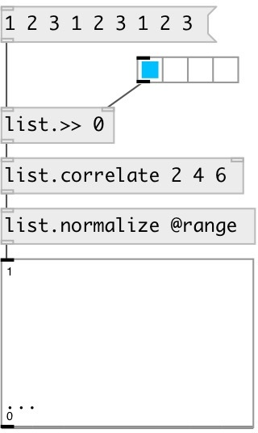

[index](index.html) :: [list](category_list.html)
---

# list.correlate

###### list cross-correlation

*доступно с версии:* 0.9.4

---

## информация
Note: may perform slowly in large lists because it does not use the FFT to compute the convolution

## аргументы:

* **B**
second argument values 
_тип:_ list 

## свойства:

* **@a** 
Запросить/установить first argument 
_тип:_ list 

* **@b** 
Запросить/установить second argument 
_тип:_ list 

* **@mode** 
Запросить/установить output mode. &#39;full&#39; - output the cross-correlation at each point of overlap,
with an output length of (M+N-1). At the end-points of the cross-correlation,
the signals do not overlap completely, and boundary effects may be seen.
&#39;valid&#39; - output of length (max(M,N)-min(M,N)+1). The cross-correlation product
is only given for points where the signals overlap completely. Values outside
the signal boundary have no effect. &#39;same&#39; - output of length max(M,N).
Boundary effects are still visible 
_тип:_ symbol 
_варианты:_ valid, same, full 
_по умолчанию:_ valid 

* **@valid** 
Запросить/установить alias to @mode valid 
_тип:_ alias 

* **@same** 
Запросить/установить alias to @mode same 
_тип:_ alias 

* **@full** 
Запросить/установить alias to @mode full 
_тип:_ alias 

## входы:

* calculate cross-correlation and output 
_тип:_ control
* set second argument (@b property) 
_тип:_ control

## выходы:

* list: output result 
_тип:_ control

## ключевые слова:

[list](keywords/list.html)
[correlation](keywords/correlation.html)
[cross](keywords/cross.html)

**Авторы:** Serge Poltavsky

**Лицензия:** GPL3 or later

