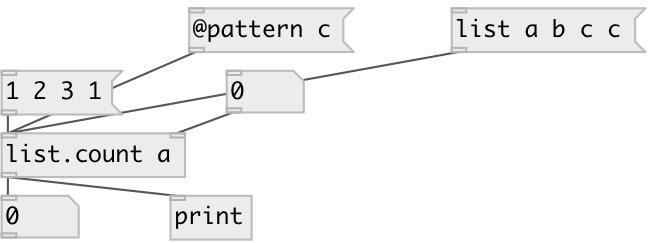

[index](index.html) :: [list](category_list.html)
---

# list.count

###### output the number of items that equal to specified value

*доступно с версии:* 0.1

---

## аргументы:

* **pattern**
count pattern value 
_тип:_ any 

## свойства:

* **@pattern** 
Получить/установить new pattern value 
_тип:_ atom 

## входы:

* Input list 
_тип:_ control
* change pattern value 
_тип:_ control

## выходы:

* count of found elements 
_тип:_ control

## ключевые слова:

[list](keywords/list.html)
[count](keywords/count.html)

**Смотрите также:**
[\[list.count_if\]](list.count_if.html)

**Авторы:** Serge Poltavsky

**Лицензия:** GPL3 or later

