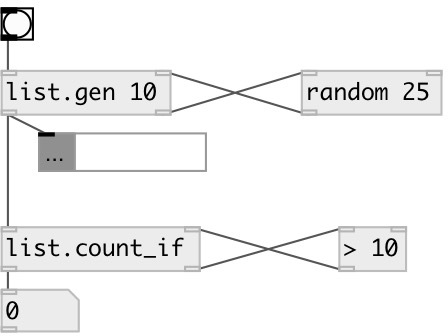

[index](index.html) :: [list](category_list.html)
---

# list.count_if

###### output the number of items that satisfy to external predicate

*доступно с версии:* 0.1

---

## входы:

* input list 
_тип:_ control
* input value from predicate. &#34;1&#34; means accepted. &#34;0&#34; means reject 
_тип:_ control

## выходы:

* count of elements 
_тип:_ control
* element output to predicate 
_тип:_ control

## ключевые слова:

[list](keywords/list.html)
[count](keywords/count.html)

**Смотрите также:**
[\[list.count\]](list.count.html)

**Авторы:** Serge Poltavsky

**Лицензия:** GPL3 or later

