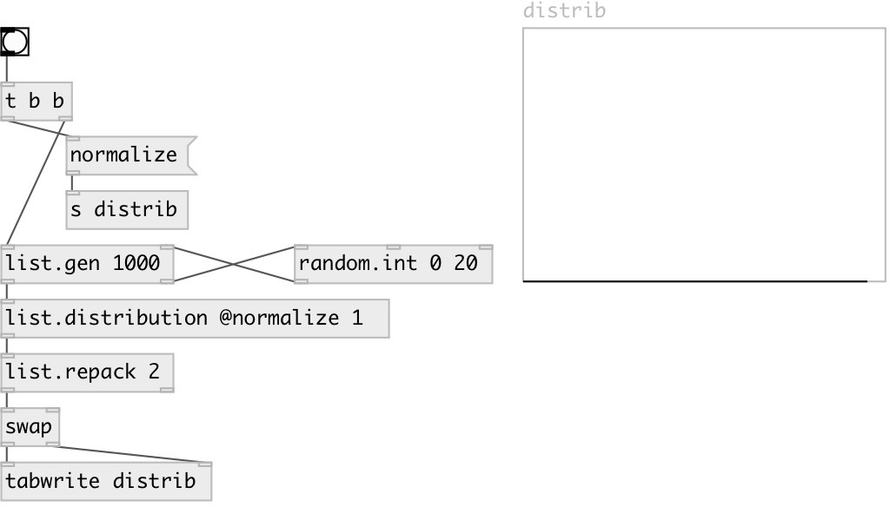

[index](index.html) :: [list](category_list.html)
---

# list.distribution

###### list value distribution

*доступно с версии:* 0.1

---

## свойства:

* **@normalize** 
Запросить/установить normalize sum to 1 
_тип:_ bool 
_по умолчанию:_ 1 

## входы:

* input list 
_тип:_ control

## выходы:

* list of pairs: first element - value, second - number of repeats in list (by default normalized to have sum 1) 
_тип:_ control

## ключевые слова:

[list](keywords/list.html)
[distribution](keywords/distribution.html)

**Авторы:** Serge Poltavsky

**Лицензия:** GPL3 or later

