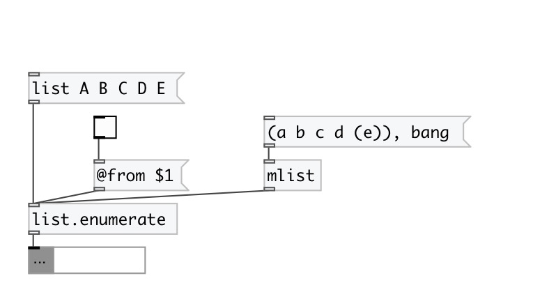

[index](index.html) :: [list](category_list.html)
---

# list.enumerate

###### enumerates input list

*доступно с версии:* 0.3

---

## свойства:

* **@from** 
Получить/установить start enumeration index 
_тип:_ int 
_по умолчанию:_ 0 

* **@append** 
Получить/установить put element index after element value 
_тип:_ flag 
_по умолчанию:_ 0 

## входы:

* input list 
_тип:_ control

## выходы:

* output list 
_тип:_ control

## ключевые слова:

[list](keywords/list.html)
[enumerate](keywords/enumerate.html)

**Авторы:** Serge Poltavsky

**Лицензия:** GPL3 or later

