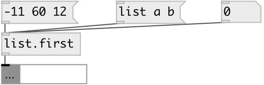

[index](index.html) :: [list](category_list.html)
---

# list.first

###### выводит первый элемент списка

*доступно с версии:* 0.1

---

## входы:

* input list 
_тип:_ control

## выходы:

* first list element 
_тип:_ control

## ключевые слова:

[list](keywords/list.html)
[first](keywords/first.html)

**Смотрите также:**
[\[list.last\]](list.last.html)
[\[list.at\]](list.at.html)

**Авторы:** Serge Poltavsky

**Лицензия:** GPL3 or later

