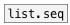
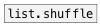
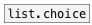

[< справка — содержание](ceammc_lib.html)
---

# list.gen


Создает список указанной длины при помощи внешнего генератора

---

Обратите внимание: длина списка ограничена 1024 элементами<br>


---


```

```

---
аргументы:

N: длина сгенерированного символа<br>

---
свойства:

@count: длина сгенерированного списка<br>

---
смотрите также:<br>
[](list.seq.html)
[](list.shuffle.html)
[](list.choice.html)
