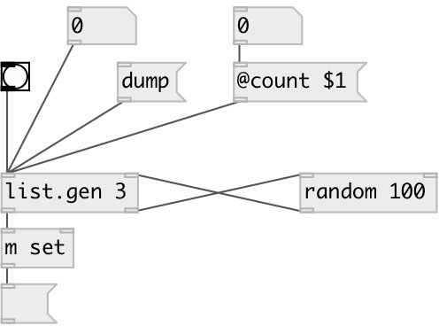

[index](index.html) :: [list](category_list.html)
---

# list.gen

###### generates list of specified length via external generator

*доступно с версии:* 0.1

---

## информация
Note, that maximum length limited to 1024 elements.

## аргументы:

* **COUNT**
length of generated list 
_тип:_ int 

## методы:

* **dump**
dump internal object state to Pd console window 

## свойства:

* **@count** 
Запросить/установить length of generated list 
_тип:_ int 
_диапазон:_ 1..1024 
_по умолчанию:_ 1 

## входы:

* starts list generation 
_тип:_ control
* input for generated values 
_тип:_ control

## выходы:

* generated list 
_тип:_ control
* bang output for generator object 
_тип:_ control

## ключевые слова:

[list](keywords/list.html)
[generate](keywords/generate.html)

**Смотрите также:**
[\[list.seq\]](list.seq.html)
[\[list.shuffle\]](list.shuffle.html)
[\[list.choice\]](list.choice.html)

**Авторы:** Serge Poltavsky

**Лицензия:** GPL3 or later

