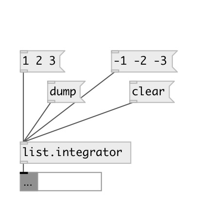

[index](index.html) :: [list](category_list.html)
---

# list.integrator

###### returns the sum of the previously stored list and the current one then stores this sum

*доступно с версии:* 0.1

---

## методы:

* **clear**
clear integrator state 

## свойства:

* **@oversize** 
Получить/установить behavior, if list have different sizes 
_тип:_ symbol 
_варианты:_ min, padz, clip, wrap, fold 
_по умолчанию:_ padz 

* **@min** 
Получить/установить alias for &#34;@oversize min&#34; property. Truncates lists to minimal common size 
_тип:_ alias 

* **@clip** 
Получить/установить alias for &#34;@oversize min&#34; property. Truncates lists to minimal common size. 
_тип:_ alias 

* **@padz** 
Получить/установить alias for &#34;@oversize padz&#34; property. Pad shortest list with zeroes. 
_тип:_ alias 

* **@clip** 
Получить/установить alias for &#34;@oversize clip&#34; property. Pad shortest list with last element to
conform longest list 
_тип:_ alias 

* **@wrap** 
Получить/установить alias for &#34;@oversize wrap&#34; property. Pad shortest list with repeated values
from the beginning. 
_тип:_ alias 

* **@fold** 
Получить/установить alias for &#34;@oversize fold&#34; property. Pad shortest list with repeated values
from the end to the beginning, then back and so on. 
_тип:_ alias 

## входы:

* Input list 
_тип:_ control

## выходы:

* new integrated list 
_тип:_ control

## ключевые слова:

[list](keywords/list.html)
[integrator](keywords/integrator.html)

**Смотрите также:**
[\[list.delta\]](list.delta.html)

**Авторы:** Alex Nadzharov, Serge Poltavsky

**Лицензия:** GPL3 or later

