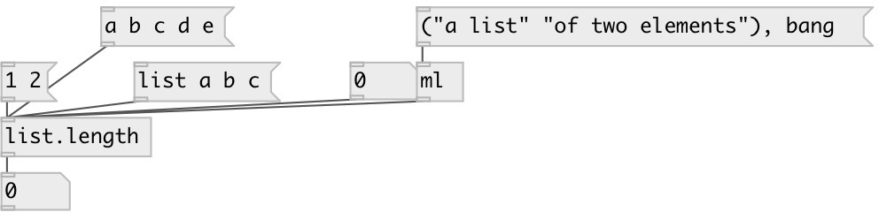

[index](index.html) :: [list](category_list.html)
---

# list.length

###### output the number of atoms in the list

*доступно с версии:* 0.1

---

## входы:

* Input list 
_тип:_ control

## выходы:

* the number of elements in the list 
_тип:_ control

## ключевые слова:

[list](keywords/list.html)
[length](keywords/length.html)
[size](keywords/size.html)

**Смотрите также:**
[\[list.at\]](list.at.html)

**Авторы:** Serge Poltavsky

**Лицензия:** GPL3 or later

