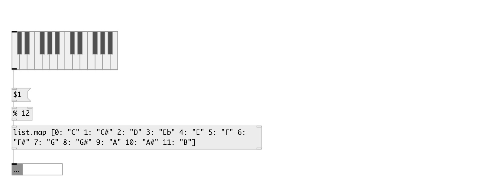

[index](index.html) :: [list](category_list.html)
---

# list.map

###### map list values by specified dictionary

*доступно с версии:* 0.9.5

---

## аргументы:

* **DICT**
mapping dictionary, see @dict property 
_тип:_ list 

## свойства:

* **@dict** 
Запросить/установить mapping dictionary, the syntax is [KEY: VALUES...], for example: [1: &#34;one&#34; 2:
&#34;two&#34; k: &#34;map values&#34;] 
_тип:_ list 
_по умолчанию:_ [] 

* **@def** 
Запросить/установить default value to replace missing keys. If empty (by default), missing keys are
ignored. 
_тип:_ list 

## входы:

* input float, no output if not in dict 
_тип:_ control
* set mapping dictionary 
_тип:_ control

## выходы:

* list or data:mlist mapped list 
_тип:_ control
* atom: missing keys 
_тип:_ control

## ключевые слова:

[list](keywords/list.html)
[map](keywords/map.html)
[dict](keywords/dict.html)

**Смотрите также:**
[\[data.dict\]](data.dict.html)

**Авторы:** Serge Poltavsky

**Лицензия:** GPL3 or later

