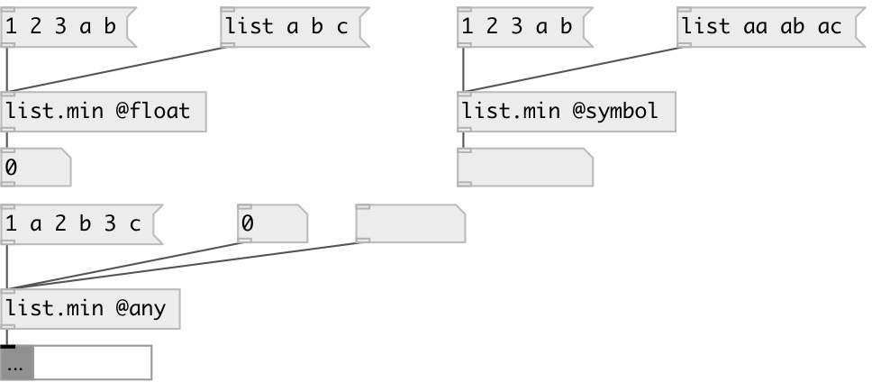

[index](index.html) :: [list](category_list.html)
---

# list.min

###### returns smallest element in the list

*доступно с версии:* 0.1

---

## информация
By default returns smallest float in list, this equal to using @float property. Also you can choose smallest symbol from list by using @symbol property.

## свойства:

* **@type** 
Получить/установить type of largest element 
_тип:_ symbol 
_варианты:_ float, symbol, any 
_по умолчанию:_ float 

* **@float** 
Получить/установить alias for @type float. Find max float element in list 
_тип:_ alias 

* **@symbol** 
Получить/установить alias for @type symbol. Find greatest symbol element 
_тип:_ alias 

* **@any** 
Получить/установить alias for @type any. Find greatest atom of any type. Note: symbols are greater
then numbers 
_тип:_ alias 

## входы:

* input list 
_тип:_ control

## выходы:

* smallest element 
_тип:_ control

## ключевые слова:

[list](keywords/list.html)
[min](keywords/min.html)
[compare](keywords/compare.html)

**Смотрите также:**
[\[list.max\]](list.max.html)
[\[list.range\]](list.range.html)

**Авторы:** Serge Poltavsky

**Лицензия:** GPL3 or later

