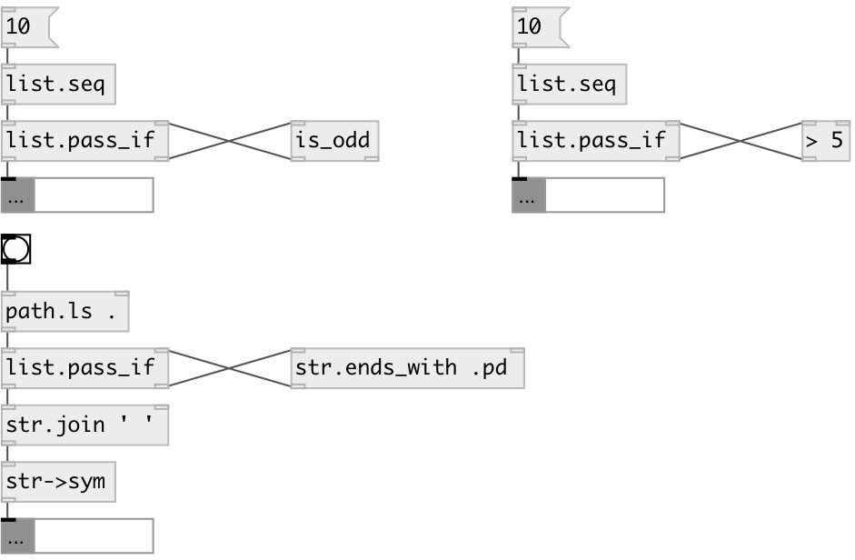

[index](index.html) :: [list](category_list.html)
---

# list.pass_if

###### leave only elements accepted by predicate

*доступно с версии:* 0.3

---

## информация
Predicate object should accept atom and output 0 (remove element) or 1 (leave element).

## входы:

* input list 
_тип:_ control
* value from predicate 
_тип:_ control

## выходы:

* output list with accepted elements 
_тип:_ control
* atom to predicate 
_тип:_ control

## ключевые слова:

[list](keywords/list.html)
[pass](keywords/pass.html)
[accept](keywords/accept.html)
[leave](keywords/leave.html)
[predicate](keywords/predicate.html)

**Смотрите также:**
[\[list.remove_if\]](list.remove_if.html)

**Авторы:** Serge Poltavsky

**Лицензия:** GPL3 or later

