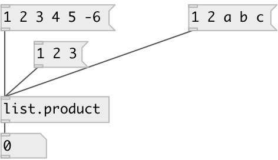

[index](index.html) :: [list](category_list.html)
---

# list.product

###### calculates product of floats in list

*доступно с версии:* 0.1

---

## информация
Note: symbol values are treated as 0. So if list contains at least one symbol, product will be always equal to zero

## входы:

* input list 
_тип:_ control

## выходы:

* float list product 
_тип:_ control

## ключевые слова:

[list](keywords/list.html)
[product](keywords/product.html)

**Смотрите также:**
[\[list.sum\]](list.sum.html)

**Авторы:** Serge Poltavsky

**Лицензия:** GPL3 or later

