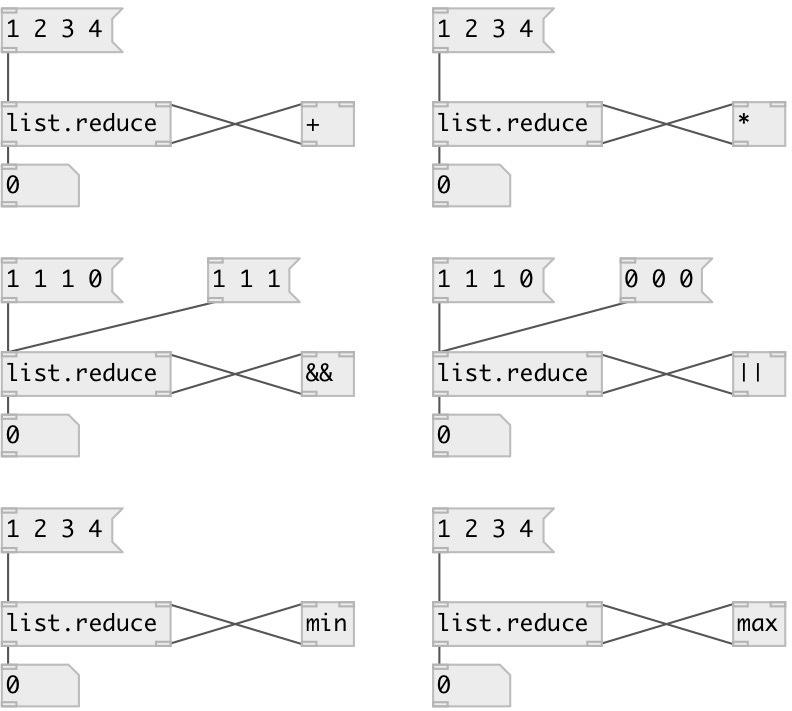

[index](index.html) :: [list](category_list.html)
---

# list.reduce

###### apply function of two arguments cumulatively to the list

*доступно с версии:* 0.1

---

## информация
Apply function of two arguments cumulatively to the list, from left to right, so as to reduce the list to a single value. You can imagine this process as a space replacement between elements with binary function, for example: 1 2 3 4 5 becames ((((1+2)+3)+4)+5) after reducing with &#34;+&#34;.

## входы:

* input list 
_тип:_ control
* value from binary function 
_тип:_ control

## выходы:

* output value 
_тип:_ control
* pair value to binary function 
_тип:_ control

## ключевые слова:

[list](keywords/list.html)
[min](keywords/min.html)
[compare](keywords/compare.html)

**Смотрите также:**
[\[list.max\]](list.max.html)

**Авторы:** Serge Poltavsky

**Лицензия:** GPL3 or later

