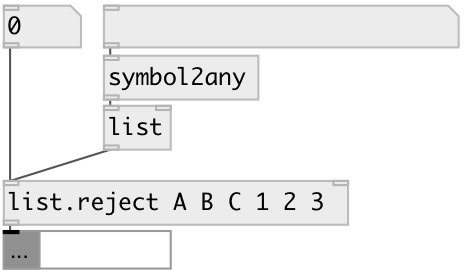

[index](index.html) :: [list](category_list.html)
---

# list.reject

###### remove specified element from list

*доступно с версии:* 0.9.5

---

## аргументы:

* **ARGS**
list of rejected values 
_тип:_ list 

## свойства:

* **@args** 
Запросить/установить list of rejected values 
_тип:_ list 

## входы:

* input float 
_тип:_ control
* set rejected values 
_тип:_ control

## выходы:

* list without rejected elements 
_тип:_ control

## ключевые слова:

[list](keywords/list.html)
[pass](keywords/pass.html)
[reject](keywords/reject.html)

**Смотрите также:**
[\[list.reject_if\]](list.reject_if.html)

**Авторы:** Serge Poltavsky

**Лицензия:** GPL3 or later

