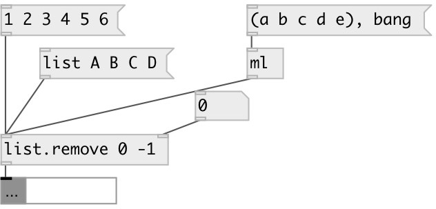

[index](index.html) :: [list](category_list.html)
---

# list.remove

###### remove list element(s) at specified positions

*доступно с версии:* 0.6

---

## аргументы:

* **INDEXES**
list of indexes to remove. Negative indexes are also supported 
_тип:_ list 

## свойства:

* **@indexes** 
Запросить/установить indexes to remove 
_тип:_ list 

## входы:

* input list 
_тип:_ control
* set remove indexes 
_тип:_ control

## выходы:

* output list 
_тип:_ control

## ключевые слова:

[list](keywords/list.html)
[remove](keywords/remove.html)

**Смотрите также:**
[\[list.insert\]](list.insert.html)

**Авторы:** Serge Poltavsky

**Лицензия:** GPL3 or later

