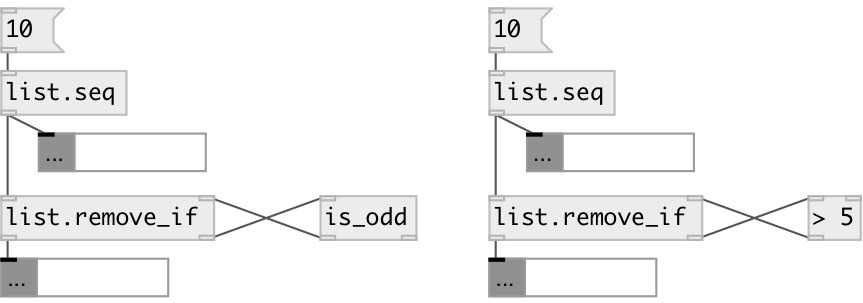

[index](index.html) :: [list](category_list.html)
---

# list.remove_if

###### remove elements by predicate

*доступно с версии:* 0.1

---

## информация
Predicate object should accept atom and output 0 (leave element) or 1 (remove).

## входы:

* input list 
_тип:_ control
* value from predicate 
_тип:_ control

## выходы:

* output list (or mlist) with some removed elements 
_тип:_ control
* atom to predicate 
_тип:_ control

## ключевые слова:

[list](keywords/list.html)
[remove](keywords/remove.html)
[predicate](keywords/predicate.html)

**Смотрите также:**
[\[list.count_if\]](list.count_if.html)
[\[list.pass_if\]](list.pass_if.html)

**Авторы:** Serge Poltavsky

**Лицензия:** GPL3 or later

