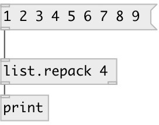

[index](index.html) :: [list](category_list.html)
---

# list.repack

###### repack list to specified size

*доступно с версии:* 0.1

---

## аргументы:

* **SIZE**
output list size 
_тип:_ int 

## свойства:

* **@size** 
Получить/установить output list size 
_тип:_ int 
_диапазон:_ 1..1024 
_по умолчанию:_ 1 

## входы:

* input list 
_тип:_ control

## выходы:

* output list 
_тип:_ control
* bang after last element output 
_тип:_ control

## ключевые слова:

[list](keywords/list.html)
[repack](keywords/repack.html)

**Авторы:** Serge Poltavsky

**Лицензия:** GPL3 or later

