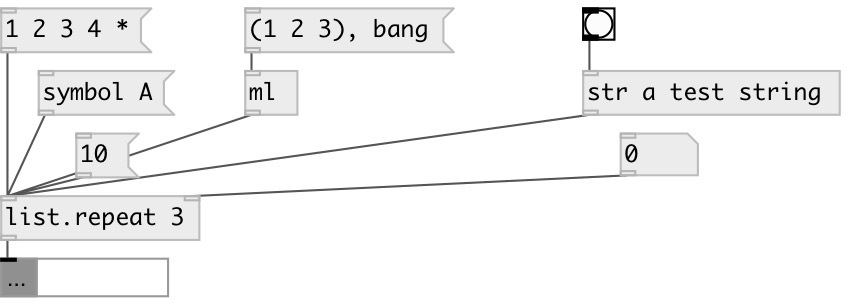

[index](index.html) :: [list](category_list.html)
---

# list.repeat

###### output new list by repeating input list specified times

*доступно с версии:* 0.1

---

## аргументы:

* **N**
repeat times 
_тип:_ int 

## свойства:

* **@times** 
Получить/установить repeat times 
_тип:_ int 
_диапазон:_ 0..10000 
_по умолчанию:_ 1 

## входы:

* input float. Example: input 10 outputs list - 10 x n times 
_тип:_ control
* repeat count 
_тип:_ control

## выходы:

* output list 
_тип:_ control

## ключевые слова:

[list](keywords/list.html)
[repeat](keywords/repeat.html)

**Авторы:** Serge Poltavsky

**Лицензия:** GPL3 or later

