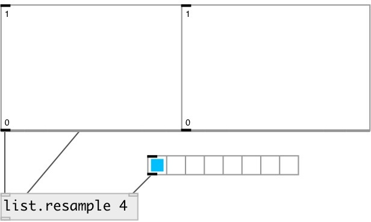

[index](index.html) :: [list](category_list.html)
---

# list.resample

###### resample list with specified ratio

*доступно с версии:* 0.9

---

## аргументы:

* **RATIO**
resample ratio 
_тип:_ float 

## свойства:

* **@ratio** 
Запросить/установить resample ratio (src/dest) 
_тип:_ float 
_диапазон:_ 0..100 
_по умолчанию:_ 1 

## входы:

* input list. 
_тип:_ control
* set ratio 
_тип:_ control

## выходы:

* new modified list 
_тип:_ control

## ключевые слова:

[list](keywords/list.html)

**Смотрите также:**
[\[list.stretch\]](list.stretch.html)

**Авторы:** Serge Poltavsky

**Лицензия:** GPL3 or later

