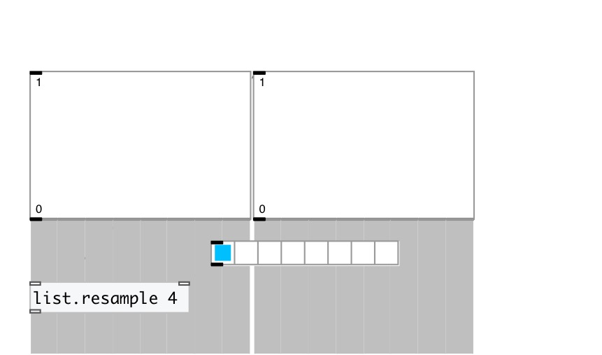

[< справка — содержание](index.html)
---

# list.resample

Передискретизация списка с указанным количеством элементов

---

 

---

---
аргументы:

RATIO: соотношение
            (ratio) 

---
свойства:

@ratio: соотношение (ratio) размеров списков (входной/выходной) для дискретизации 

---
смотрите также: 

