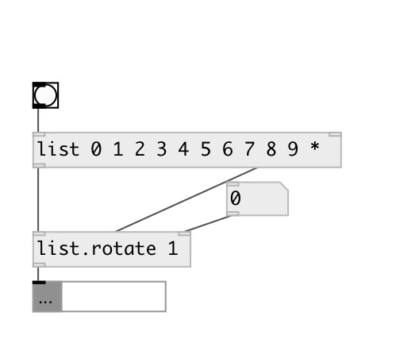

[index](index.html) :: [list](category_list.html)
---

# list.rotate

###### rotates list

*доступно с версии:* 0.1

---

## информация
[list.rotate] and [list.&gt; rotates right.

## аргументы:

* **STEP**
rotate step. Negative step changes rotation direction 
_тип:_ int 

## свойства:

* **@step** 
Получить/установить rotate step. Negative value change rotation direction to opposite 
_тип:_ int 
_по умолчанию:_ 1 

## входы:

* input list 
_тип:_ control
* rotation step 
_тип:_ control

## выходы:

* rotated list 
_тип:_ control

## ключевые слова:

[list](keywords/list.html)
[rotate](keywords/rotate.html)

**Смотрите также:**
[\[list.choice\]](list.choice.html)

**Авторы:** Serge Poltavsky

**Лицензия:** GPL3 or later

