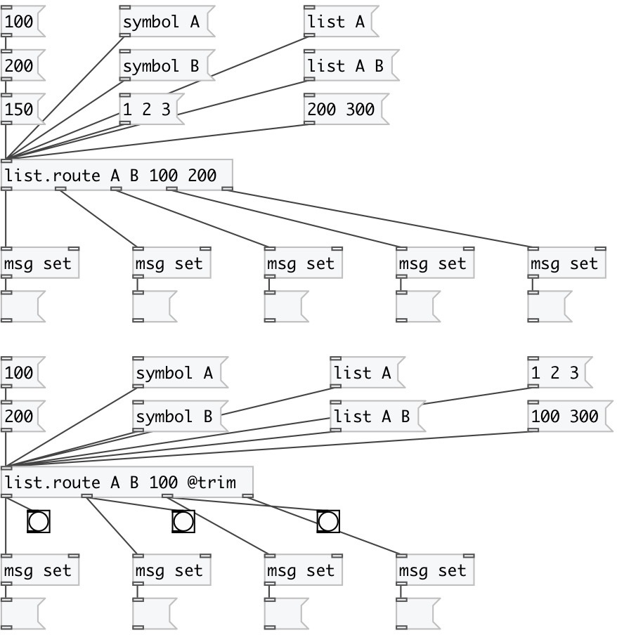

[index](index.html) :: [list](category_list.html)
---

# list.route

###### acts like [route] but for lists

*доступно с версии:* 0.5

---

## информация
Outputs float, symbol or list to matched outlet or to last outlet if no match

## аргументы:

* **@type**
list of matched atoms 
_тип:_ list 

## свойства:

* **@args** 
Получить/установить matching atoms 
_тип:_ list 

* **@trim** 
Получить/установить cut first element from list, transform float or symbol to bang 
_тип:_ flag 
_по умолчанию:_ 0 

* **@simplify** 
Получить/установить one element list simplification - transform them to floats or symbols 
_тип:_ int 
_варианты:_ 0, 1 
_по умолчанию:_ 1 

* **@as_any** 
Получить/установить trim list or symbol selector on output 
_тип:_ flag 
_по умолчанию:_ 0 

## входы:

* input list 
_тип:_ control

## выходы:

* first match 
_тип:_ control
* second match 
_тип:_ control
* nth match 
_тип:_ control
* unmatched element (without changes) 
_тип:_ control

## ключевые слова:

[list](keywords/list.html)
[route](keywords/route.html)

**Смотрите также:**
[\[route\]](route.html)

**Авторы:** Serge Poltavsky

**Лицензия:** GPL3 or later

