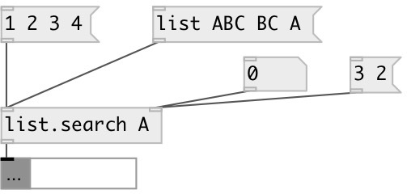

[index](index.html) :: [list](category_list.html)
---

# list.search

###### search specified items in input list

*доступно с версии:* 0.6

---

## информация
Returns item position in list or -1 if not found. If several items are specified returns list of positions.

## входы:

* input list 
_тип:_ control
* set searched items 
_тип:_ control

## выходы:

* position of search item or list of such positions 
_тип:_ control

## ключевые слова:

[list](keywords/list.html)
[search](keywords/search.html)
[find](keywords/find.html)

**Смотрите также:**
[\[list.^search\]](list.%5Esearch.html)

**Авторы:** Serge Poltavsky

**Лицензия:** GPL3 or later

