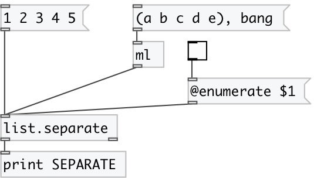

[index](index.html) :: [list](category_list.html)
---

# list.separate

###### sends list elements one by one separately

*доступно с версии:* 0.3

---

## свойства:

* **@enumerate** 
Запросить/установить enumeration mode. If enumeration is active output pairs: INDEX ATOM, otherwise
single atoms 
_тип:_ bool 
_по умолчанию:_ 0 

* **@from** 
Запросить/установить enumeration starting index 
_тип:_ int 
_по умолчанию:_ 0 

## входы:

* input list 
_тип:_ control

## выходы:

* outlet for single atoms (or pair: IDX ATOM in enumeration mode) 
_тип:_ control
* outputs bang after last element in the list 
_тип:_ control

## ключевые слова:

[list](keywords/list.html)
[separate](keywords/separate.html)

**Смотрите также:**
[\[list.repack\]](list.repack.html)
[\[list.unpack\]](list.unpack.html)

**Авторы:** Serge Poltavsky

**Лицензия:** GPL3 or later

