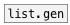

[< справка — содержание](ceammc_lib.html)
---

# list.seq


Генератор последовательностей чисел

---

<br>


---


```


[B]            [1 -1 0.1(
|       [2 10( |
|  [F]  |      |
|  |    |      |
[list.seq 3 10 2]
|
[m set]
|
[ (

            
```

---
аргументы:

FROM: начальное значение<br>
TO: конечное значение<br>
STEP: размер шага<br>

---
свойства:

@from: начальное значение<br>
@to: конечное значение<br>
@step: размер шага (всегда больше 0)<br>
@closed: если 1, используется весь диапазон значений<br>

---
смотрите также:<br>
[](list.gen.html)
