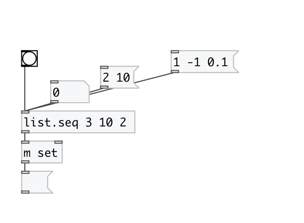

[< справка — содержание](index.html)
---

# list.seq

Генератор последовательностей чисел

---

 

---

---
аргументы:

FROM: начальное значение 
TO: конечное значение 
STEP: размер шага 

---
свойства:

@from: начальное значение 
@to: конечное значение 
@step: размер шага (всегда больше 0) 
@closed: если 1, используется весь диапазон значений 

---
смотрите также: 

